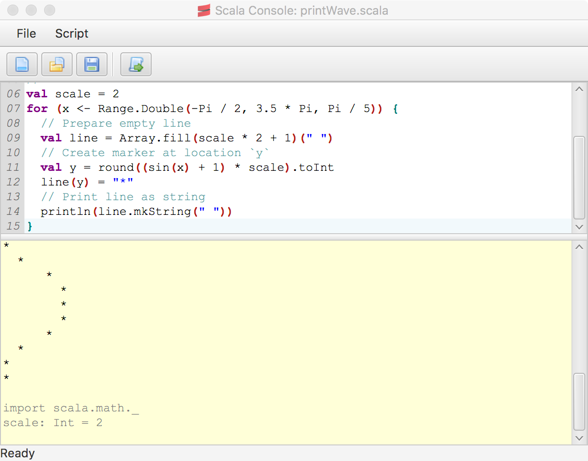

ijp-scala-console
=================

IJP Scala Console is simple user interface for executing Scala scripts.

[](https://github.com/ij-plugins/scala-console/actions)
[](https://maven-badges.herokuapp.com/maven-central/net.sf.ij-plugins/scala-console_3)
[](https://javadoc.io/doc/net.sf.ij-plugins/scala-console_3)

**Contents**

<!-- TOC -->

* [ijp-scala-console](#ijp-scala-console)
    * [ImageJ Script Examples](#imagej-script-examples)
    * [ImageJ Plugin Download](#imagej-plugin-download)
    * [Related Projects](#related-projects)
    * [License](#license)

<!-- TOC -->

Overview
--------

The Scala Console can be run stand-alone, embedded in a desktop application, or [ImageJ] plugin. UI is build with
ScalaFX.



ImageJ Plugin Download
----------------------

Binaries can be downloaded from the [releases] page. Extract the binaries to the ImageJ plugins directory. The plugin
will be available through ImageJ menu: `Plugins` > `Scripting` > `Scala Console`.

ImageJ Script Examples
----------------------

### Get Access to Current Image

Assume that you opened an image in ImageJ, for instance, using `File` > `Open Samples` > `Leaf`

The following script will get a handle to the current activa image (`IJ.getImage`), assign it to a value `imp`, and then
print it:

```scala
import ij.IJ

val imp = IJ.getImage
println(imp)
```

Note: if there is no image open a "No image" dialog will be shown and execution will be aborted

Note: that the first thing the script does is to import ImageJ's object `IJ` from package `ij`. Object `IJ` contains
many
frequently used ImageJ methods, like:

* `getImage` - get current image
* `openImage` - load image from a file
* `run` - run a plugin or a command
* `save`  - save current image
* `setSlice` - select slice in current image
* `showMessage` - display dialog with a message

Full list can be found here: https://imagej.nih.gov/ij/developer/api/ij/ij/IJ.html

Note: you can use methods contained in `IJ` directly, without prefixing with `IJ`. To do that import a specific method,
for instance, `import ij.IJ.getImage` or all the available methods `import ij.IJ.*`. Here is a shorted version of the
above example:

```scala
import ij.IJ.*

println(getImage)
```

### Run a command "Median..." to process current image  

You can execute any menu command using `IJ.run` method and providing command name. In simplest form you only provide command name, it will run on the current open image:
```scala
import ij.IJ.*

run("Median...")
```
The command may open additional dialog asking for options. If you know what options you want to pass you can do that:
```scala
import ij.IJ.*

run("Median...", "radius=4")
```
If you want to control on which image the command runs, you can do that too: 
```scala
import ij.IJ.*

val imp = getImage
run(imp, "Median...", "radius=4")
```
The options are listed in a single string using names of fields in the dialog. For boolean values, you use only filed name if value is true (checkbox is checked), you skip the field name of value is false.

Hint: You can use Macro Recorder (`Plugins` > `Macros` > `Record`) to record a command then copy it to your script.

Additional example scripts can be found the [examples] directory.


Related Projects
----------------

* [ScalaInterpreterPane] - a Swing component for editing code in the Scala programming language and executing it in an
  interpreter.
* [Scala Scripting](https://github.com/scijava/scripting-scala/) - a library providing a JSR-223-compliant scripting
  plugin for the Scala language, part of [SciJava Script Editor] project. The project support multiple scripting
  languages. Detailed info can be found at [Using the Script Editor](https://imagej.net/scripting/script-editor) wiki.

License
-------

This library is free software; you can redistribute it and/or
modify it under the terms of the GNU Lesser General Public
License as published by the Free Software Foundation; either
version 2.1 of the License, or (at your option) any later version.

This library is distributed in the hope that it will be useful,
but WITHOUT ANY WARRANTY; without even the implied warranty of
MERCHANTABILITY or FITNESS FOR A PARTICULAR PURPOSE. See the GNU
Lesser General Public License for more details.

You should have received a copy of the GNU Lesser General Public
License along with this library; if not, write to the Free Software
Foundation, Inc., 59 Temple Place, Suite 330, Boston, MA 02111-1307 USA


[ImageJ]: http://rsb.info.nih.gov/ij/

[examples]: https://github.com/ij-plugins/ijp-scala-console/tree/main/scala-console/examples

[releases]: https://github.com/ij-plugins/ijp-scala-console/releases

[ScalaInterpreterPane]: https://github.com/Sciss/ScalaInterpreterPane

[SciJava Script Editor]: https://github.com/scijava/script-editor